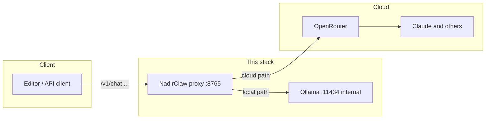

# Sovereign stack (NadirClaw + Ollama)

## Intent

This project is a **sovereign AI coding stack**: a single **OpenAI-compatible** HTTP API you can point tools at (e.g. editors, CLI) so you can use a **local** code model for routine work and a **cloud** model (via **OpenRouter**) when the task is large or the local pass fails quality checks.

**Goals:**

- **Reduce cloud dependency** for day-to-day edits while keeping a **reliable** escape hatch.
- **Fit modest hardware** (e.g. ~12GB VRAM): the default local path is **Ollama** with a **quantized** coding model, not a full 14B in FP16.
- **Optionally** expose the proxy only on your **Tailscale** network by running the Tailscale client on the host and binding the HTTP port to `127.0.0.1` (see *Networking*).

Nadirclaw is an **orchestrating proxy**, not the inference engine. **Ollama** serves the local model; the proxy forwards to it or to **OpenRouter** and applies routing and optional checks.

## Architecture (high level)



**Control flow (simplified):**

1. The client calls **`POST /v1/chat/completions`** on Nadir (same general shape as OpenAI).
2. Nadir reads **routing metadata** (see *Routing*). It chooses **local** (Ollama) or **cloud** (OpenRouter). For local requests, it can **shrink** user/assistant text (comment stripping, blank-line collapse) to save input tokens.
3. If the route is **local** and verification is on, the assistant text can be run through **Prettier / ESLint** on extracted JS/TS. On failure, Nadir may run **one** self-correction round against the local model, then **escalate** to the cloud model if a key is set.

## Components

| Piece | Role |
|--------|------|
| **Ollama** | Local inference; OpenAI-compatible **`/v1`** surface inside the compose network. Models and weights live in a Docker volume (`ollama_data`). |
| **Nadirclaw** | **FastAPI** app: `POST /v1/chat/completions`, `GET /v1/models`, `GET /health`. Forwards to Ollama or OpenRouter, applies **routing**, **minify**, and the **verification loop** when enabled. |
| **OpenRouter** | Cloud models (e.g. large-context or when escalation is required). **API key** is read from env (`NADIR_OPENROUTER_API_KEY`). |
| **Docker Compose** | Runs **Ollama** and **Nadir** on a private network. Nadir is published on the host as **`127.0.0.1:8765`**. |
| **cloudflared (optional, profile `public`)** | **Cloudflare quick tunnel** — public **HTTPS** URL to Nadir (for clients like Cursor that block private IPs in the **Override OpenAI** path). See *Public URL* below. |
| **ngrok (optional, profile `ngrok`)** | Another tunnel option; set **`NGROK_AUTHTOKEN`** in **`.env`**, then `docker compose --profile ngrok up -d ngrok`. |
| **Scripts** (`scripts/ensure-docker.js`, `scripts/compose-up.js`) | **CVReady-style** helpers: ensure the Docker **daemon** is up (on Windows, can start Docker Desktop and wait), then run `docker compose`. |
| **Tailscale (host)** | Not a container in this stack by default. Install on the **host**, use **`tailscale serve`** or your tailnet IP; keep Nadir bound to localhost for a smaller attack surface. |

## Request routing (contract)

Nadir does not infer “file size” on its own. **You** (or a thin client shim) must pass metadata, either as JSON next to the chat payload or via headers.

**Body (optional, stripped before upstream):**

```json
{
  "model": "gpt-4",
  "messages": […],
  "nadir": {
    "lines": 420,
    "multi_file": false,
    "complex": false,
    "language": "typescript"
  }
}
```

**Or headers:** `X-Nadir-Lines`, `X-Nadir-Multi-File`, `X-Nadir-Complex`

**Default rules (configurable via `NADIR_*` in `.env`):**

- **`lines` above `NADIR_MAX_LINES_FOR_LOCAL`** (default 650) → **cloud** (or **local** if you set policy otherwise).
- **`multi_file: true` or `complex: true` (when `NADIR_USE_COMPLEXITY_FLAG` is on)** → **cloud**.
- **Missing `lines`:** **`NADIR_ON_MISSING_METADATA`** (default `cloud` in the example) decides local vs cloud.

The **`model`** field in the request is not treated as the sole authority: Nadir sets the actual upstream model from **`NADIR_LOCAL_MODEL`** / **`NADIR_CLOUD_MODEL`**.

## Repository layout

```text
sovereign-stack/
  demo/index.html         # PeaBrain browser demo (served at /demo/)
  docker-compose.yml      # Ollama + Nadir
  Dockerfile              # Nadir image (Python + Node for linters)
  package.json            # npm scripts: docker:ensure, stack:up, …
  requirements.txt
  .env.example
  setup.ps1 / setup.sh    # first-time and repeat bring-up
  scripts/
    ensure-docker.js
    compose-up.js
    public-tunnel.js     # start Cloudflare quick tunnel (public URL for Cursor, etc.)
    one-shot-chat.mjs
    chat-repl.mjs
    lib/chat-defaults.mjs
  nadirclaw/                # Python package
    main.py
    nadirclaw_config.py
    router.py
    providers/
    context/
    quality/
  linters/                  # ESLint config for the verification pass
```

## Quick start

1. Install **Docker** (e.g. Docker Desktop on Windows) and, on this repo, **Node** is recommended so the ensure/compose scripts can start and wait for Docker.
2. Copy **`.env.example` → `.env`**, set **`NADIR_OPENROUTER_API_KEY`** if you use cloud or escalation.
3. Run **`.\setup.ps1`** (Windows) or **`./setup.sh`** (macOS / Linux / WSL). The script brings Compose up and pulls the default Ollama model.
4. **Showcase (browser):** `docker-compose.yml` **bind-mounts** `sovereign-stack/demo` → `/app/demo`. The image also ships **`nadirclaw/bundled_peabrain.html`** (a copy of the demo) so `/demo/` still works if the mount is empty or points at the wrong folder (common on Windows if compose is run from the wrong directory). Open **`http://127.0.0.1:8765/demo/`** after **rebuilding** Nadir: from **`sovereign-stack`**, run **`docker compose up -d --build`**, not only `--pull`. If the browser still shows 404, you are almost certainly hitting an **old** container: **`docker compose down`** then **`docker compose up -d --build`**, or `docker ps` to confirm the `nadir` service was recreated. Optional: **`npm run demo`** after `/health` is up. The demo uses a **PeaBrain** system prompt and passes **`temperature` / `top_p` / `max_tokens` / …** to Ollama; edit the **`PEABRAIN` string** in **`demo/index.html`**, or tune without editing via URL query, e.g. `?temperature=0.5&max_tokens=900&top_p=0.88`. For **`npm run chat`**, set **`NADIR_CHAT_SYSTEM`** and **`NADIR_CHAT_TEMPERATURE`**, etc. in **`.env`** (see **`.env.example`**). **Runtime:** run **`npm run demo:sync`** to refresh **`nadirclaw/bundled_peabrain.html`**, or rely on the bind mount + rebuild. **Web search (demo):** add **`NADIR_TAVILY_API_KEY`** or **`NADIR_BRAVE_SEARCH_API_KEY`** in **`.env`**, restart Nadir, then enable **Search the web first** on **`/demo/`** (API keys stay on the server). Optional **`NADIR_WEB_SEARCH_MAX_RESULTS`**. **Pasted URLs (demo):** enable **Fetch page text for URLs** and include **`https://…` links** in your message; Nadir fetches them via **`/api/demo/fetch-url`** (SSRF-protected, no search API key). Tuning: **`NADIR_DEMO_URL_FETCH_MAX_TEXT`** in **`.env`**. 
5. Point any OpenAI-compatible client to **`http://127.0.0.1:8765/v1`**, and include **`nadir`** (or the headers) so routing behaves as you expect.

**One-off without setup scripts (from this directory):** `npm run stack:up` (runs ensure + `docker compose up -d --build`).

**Stopping everything:** `npm run stack:down` stops the stack **including** optional **cloudflared** / **ngrok** profile services (so the Docker network is not left “in use”). If you ever used profiles manually and see *Resource is still in use*, run: `docker compose --profile public --profile ngrok down`.

## Public URL (Cursor, remote HTTPS clients)

Some tools (e.g. **Cursor** with a custom **OpenAI**-compatible model) call your **Override Base URL** from **their** infrastructure and **refuse** private hostnames (`127.0.0.1`, tailnet IPs, etc.). For that, you need a **public HTTPS** URL that forwards to Nadir.

1. (Recommended for internet exposure) Set a random secret in **`.env`**: `NADIR_INBOUND_BEARER_TOKEN=…` and restart: `npm run stack:up` (or `docker compose up -d --build`). Browsers and Cursor must send **`Authorization: Bearer <that token>`** for **public** hostnames and for `127.0.0.1` if you set **`NADIR_INBOUND_BEARER_LOCALHOST_BYPASS=false`**. When bypass is **true** (the default), requests with **`Host`** matching **`127.0.0.1`**, **`localhost`**, or **`::1`** (e.g. **`http://127.0.0.1:8765/demo/`)** do not require the header. The PeaBrain **bearer** field (saved in **localStorage**) is for **public** tunnel URLs. **`/health`**, **`GET /api/demo/web-search/config`**, and the **`/demo/`** HTML stay unauthenticated.
2. From **`sovereign-stack/`**, run **`npm run public:url`**. This starts the normal stack and the **cloudflared** service (Compose profile **`public`**), which runs a [Cloudflare quick tunnel](https://developers.cloudflare.com/cloudflare-tunnels/learning/trycloudflare/) to `http://nadir:8765` inside the compose network.
3. Get the host: **`npm run public:url:logs`** and find a line with **`trycloudflare.com`** (your base is `https://<that-host>/v1`). The URL **changes** when the tunnel container restarts unless you use a product like named Cloudflare Tunnels or ngrok with a reserved domain.
4. To stop the tunnel: **`npm run public:url:down`**.

**Without npm:** `docker compose --profile public up -d cloudflared` after the base stack is up, then `docker compose --profile public logs -f cloudflared`. **ngrok** instead: set **`NGROK_AUTHTOKEN`** in **`.env`**, then `docker compose --profile ngrok up -d ngrok` and read **`docker compose --profile ngrok logs -f ngrok`**.

Treat any public URL as **sensitive**: anyone who can open it can run your local model and (if the OpenRouter key is in **`.env`**) possibly trigger **cloud** routing unless you design routing and env accordingly.

## Next steps

1. **Configure `.env`:** set **`NADIR_OPENROUTER_API_KEY`** when you want **cloud** routing or **escalation** after a failed local+lint pass. You can use **local-only** (no key) for experiments; routing may still try cloud if your client omits `lines` and `NADIR_ON_MISSING_METADATA=cloud` (default in `.env.example`).
2. **Tune routing:** `NADIR_MAX_LINES_FOR_LOCAL`, `NADIR_ON_MISSING_METADATA` (`local` vs `cloud` when `lines` is missing).
3. **Tie your editor in (Cursor, etc.):** see **[CURSOR.md](./CURSOR.md)**. Set **`NADIR_IDE_MODE=true`** so clients that cannot send `nadir` JSON still use **Ollama**; add an **OpenAI-compatible** base URL **`http://127.0.0.1:8765/v1`** and a dummy **API key** in the editor’s model settings. Without IDE mode, use **`NADIR_ON_MISSING_METADATA=local`** as a looser alternative.
4. **Remote access:** on the home PC, use **Tailscale** and/or **`tailscale serve --bg 8765`**; from the laptop, set the client base URL to the **tailnet address** and port.
5. **Hardening:** the host port is **`127.0.0.1` only** by default. If you use a **public tunnel**, enable **`NADIR_INBOUND_BEARER_TOKEN`** and stop the tunnel when you are not using it. Do not point an unmanaged public URL at Nadir without that token.

## Test and interface (chat, curl, Cursor)

**Health:** `Invoke-RestMethod http://127.0.0.1:8765/health` (PowerShell) or `curl -s http://127.0.0.1:8765/health`.

**One-shot (uses Node 18+ `fetch`):** from `sovereign-stack/`,

```bash
node scripts/one-shot-chat.mjs "Explain what a linked list is in one paragraph"
```

or `npm run chat:one -- "Your question"`.

**Simple multi-turn chat in the terminal:**

```bash
npm run chat
# or: node scripts/chat-repl.mjs
```

Set **`NADIR_BASE`** if the proxy is not on localhost (e.g. `NADIR_BASE=http://100.x.y.z:8765 npm run chat`).

**Casual questions looked like “code reviews”:** the default Ollama model is **Qwen2.5-Coder**, tuned for programming. Without guidance it may answer “how are you?” with TypeScript. The chat scripts add a small **system** message (`scripts/lib/chat-defaults.mjs`); override the full text with **`NADIR_CHAT_SYSTEM`** if you want. For **non-code** chat as a main use case, also consider a general-purpose Ollama model and **`NADIR_LOCAL_MODEL`** in `.env`.

**`curl` smoke test (local route):** send **`nadir.lines`** with your request:

```bash
curl -s http://127.0.0.1:8765/v1/chat/completions \
  -H "Content-Type: application/json" \
  -d "{\"model\":\"n\",\"messages\":[{\"role\":\"user\",\"content\":\"Hi\"}],\"nadir\":{\"lines\":50,\"multi_file\":false,\"complex\":false}}"
```

**Ollama without Nadir (raw model only):** `docker compose exec ollama ollama run qwen2.5-coder:14b` — **bypasses** routing, verification, and OpenRouter. Useful to confirm the model runs; Nadir is the “real” product path for the sovereign stack.

## Networking and security notes

- Nadir listens on **`127.0.0.1:8765`** on the host, not on all interfaces, by default in `docker-compose.yml`.
- **OpenRouter** credentials live in **`.env` on the host**; do not commit that file. Prefer **machine-local** or **secret store** patterns in real deployments.
- **Tailscale**: use host ACLs and, if you use `serve`, understand whether traffic is **tailnet-only** vs broader.

## Related ideas (out of scope here)

- **vLLM** and **GGUF** are different stacks: this repo standardizes on **Ollama** for broad GPU compatibility. You can still point **`NADIR_LOCAL_BASE`** at any **OpenAI-compatible** URL if you run the engine elsewhere.
- **Speculative decoding** and multi-model local setups are possible future work on the Ollama/vLLM side, not part of the current Nadirclaw service.

## License

Follow the license of the parent **PeaBrain** repository, or add a dedicated `LICENSE` here if you split this folder into its own project.
